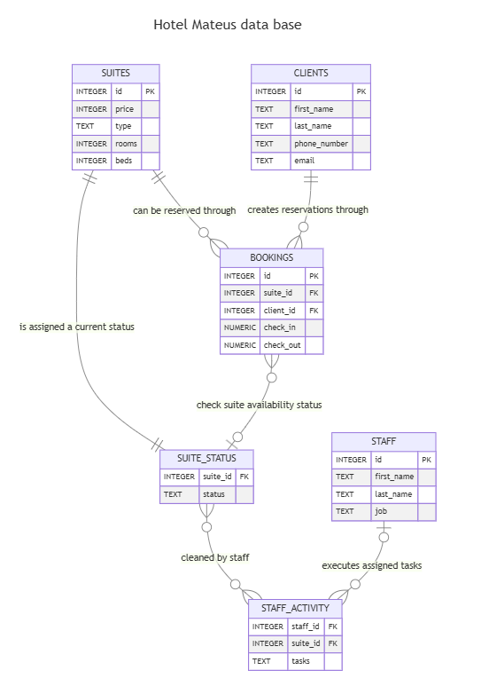

# Design Document

By Daniel Mohamad Mateus Quiñones

Video overview: [Hotel Mateus database video.](https://youtu.be/NybyQKK6OvM)

## Scope

The following project consists of a database for a large hotel with many suites. The database will facilitate the booking process as well as ensure that a suite is available, clean, and ready to be booked. It also allows us to keep track of customers and staff employees.

* The purpose of the database is to ensure that, if not all, most suites get booked. suites, including information about its features and price.
* Clients, including basic identifying and contact information.
* Staff, including basic identifying information and job/role.
* Bookings, including the suite, the person to whom it was assigned and check-in and check-out date information.
* Suite status, from which we can see which suites are available, and which ones require cleaning.

Out of scope we find elements like client satisfaction, employee performance, and other aspects not related to the core functioning of hotel operations.

## Functional Requirements

This database will support:

* Adding new clients and staff.
* Adding new suites.
* Tracking suite status mainly, to ensure hotel operation.
* Summaries and insights like our total earnings.

Note: We have many constraints, and triggers that facilitate the job in our database. This is an advantage when it comes to adding new suites but will make it difficult to delete a suite that goes out of business.

## Representation

Entities are captured in SQLite tables with the following schema.
``` SQL
CREATE TABLE "suites"(
    "id" INTEGER,
    "price" INTEGER NOT NULL,
    "type" TEXT NOT NULL CHECK ("type" IN ('luxury','business','family')), --Luxury, business, family
    "rooms" INTEGER NOT NULL,
    "beds" INTEGER NOT NULL,
    PRIMARY KEY("id")
);

CREATE TABLE "clients"(
    "id" INTEGER,
    "first_name" TEXT NOT NULL,
    "last_name" TEXT NOT NULL,
    "phone_number" TEXT UNIQUE,
    "email" TEXT UNIQUE,
    PRIMARY KEY("id")
);

CREATE TABLE "staff"(
    "id" INTEGER,
    "first_name" TEXT NOT NULL,
    "last_name" TEXT NOT NULL,
    "job" TEXT NOT NULL UNIQUE,
    PRIMARY KEY("id")
);

-- Actions tables: These represent relationships and processes.
CREATE TABLE "bookings" (
    "id" INTEGER,
    "suite_id" INTEGER,
    "client_id" INTEGER,
    "check_in" NUMERIC,
    "check_out" NUMERIC,
    PRIMARY KEY ("id"),
    FOREIGN KEY ("suite_id") REFERENCES "suites"("id"),
    FOREIGN KEY ("client_id") REFERENCES "clients"("id")
);

CREATE TABLE "suite_status" (
    "suite_id" INTEGER,
    "status" TEXT DEFAULT 'ready' CHECK ("status" IN('ready','booked', 'cleaning')), -- Ready, booked, cleaning
    FOREIGN KEY ("suite_id") REFERENCES "suites"("id")
);

CREATE TABLE "staff_activity"(
    "staff_id" INTEGER NOT NULL,
    "suite_id" INTEGER,
    "tasks" TEXT NOT NULL,
    FOREIGN KEY ("suite_id") REFERENCES "suites"("id"),
    FOREIGN KEY ("staff_id") REFERENCES "staff"("id")
);

-- The triggers, views and indexes can be seen with detail in schema.sql file.
```

### Entities

The database includes the following entities:

#### Suites

The `suites` table includes:

* `id`, this is an `INTEGER` unique ID and `PRIMARY KEY` to identify suites and relate them later on with bookings and status.
* `price`, which specifies the price per night of that suite as `INTEGER` to facilitate calculations. I did not include any currency symbols.
* `type`, which specifies the type of the room as `TEXT` and also is bound to a constraint of three elements `CHECK ("type" IN ('luxury','business','family'))`. This means the type of a suite can only be luxury, business or family.
* `rooms`, which specifies the number of rooms inside a suite as `INTEGER`
* `beds`, which specifies the number of beds inside a suite as `INTEGER` usually the number of beds is twice the amount of rooms or two beds per room.

The suites table has a trigger so when we `INSERT` a new suite into suites, a suite_status will be automatically generated. Also, all columns in the `suites` table are required, for this reason all of them should be `NOT NULL`.

#### Clients

The `clients` table includes:

* `id`, which specifies the unique ID for a new registered client as `INTEGER`. This column has the `PRIMARY KEY` constraint applied.
* `first_name`, which specifies the name of our client as `TEXT`. This column can't be `NULL` because we need to know our client's name.
* `last_name`, which specifies the last name of our client as `TEXT`. This column can't be `NULL` because we need to know our client's name.
* `phone_number`, which specifies the phone number of our client as `TEXT`. This was originally meant to be INT but then I realized that international numbers have symbols like +1 in the US. Also, this column has to be `UNIQUE` which would prevent unnecessary duplication of clients
* `email`, which specifies our client's email as `TEXT` being `UNIQUE` to prevent data duplication.

#### Staff

The `Staff` table includes:

* `id`, which specifies the unique ID for a staff member as `INTEGER`. This column has the `PRIMARY KEY` constraint applied.
* `first_name`, which specifies the name of our employee as `TEXT`.
* `last_name`, which specifies the last name of our employee as `TEXT`.
* `job`, which specifies the rol or job of our employee as `TEXT`

All columns in `staff` are required and for this reason all of them should be constraint by `NOT NULL`. This is the only necessary constraint.

#### Bookings

The `bookings` table includes:

* `id`, which specifies the unique ID for a booking made by a customer as `INTEGER`. This column has the `PRIMARY KEY` constraint applied.
* `suite_id`, which specifies the suite's ID as `INTEGER`. This comes from the table `suites` and hence have the `FOREIGN KEY` constraint applied.
* `client_id`, which specifies the client's ID as `INTEGER`. This comes from the table `clients` and hence have the `FOREIGN KEY` constraint applied.
* `check_in`, which specifies the exact date and hour when our clients enter the suite as `NUMERIC`.
* `check_out`, which specifies the exact date and hour when our clients exit the suite as `NUMERIC`.

For check-in and check-out we use the `NOT NULL` constraint since they are required to calculate the total price of a booking.

#### Suite_status

The `suite_status` table includes:

* `suite_id`, which specifies the suite's ID from `suites` as `INTEGER` with `FOREIGN KEY` constraint applied.
* `status`, which specifies the status of the suite as `TEXT` is bound to a constraint of three elements `CHECK ("status" IN ('ready','booked','cleaning'))` by `DEFAULT` 'ready' as soon as data is `INSERT` with the trigger.

This table will be automatically updated by `staff_activity` thanks to a trigger that identifies if a room has been cleaned.

#### Staff_activity

The `staff_activity` table includes:

* `staff_id`, which references through `FOREIGN KEY` the id of the employee in `staff`.
* `suite_id`,  which references through `FOREIGN KEY` the id of the suite in `suites`.
* `tasks`, which refers to the task that a employee performs in the hotel, it can be any task but it will update the suite status only if the task done was `clean`.

All columns are required and have `NOT NULL` or `FOREIGN KEY` constraint applied.

### Relationships

The following relationship diagram describes the relationship among the entities or tables inside the database.


As detailed by the diagram:

* A suite can have 0 to many bookings. 0 if they have never been booked and many if clients have reserved them through bookings.
* Similarly a client can have 0 to many bookings. 0 if the client only registered to the hotel but didn't purchase and many if the client has stayed many times at the hotel.
* A booking must have exactly one suite within a given time span. Also, a booking must have exactly one client within a given time span.
* A suite can have only and must have at least one suite_status and vice versa. This is to ensure we know the availability and the status of a suite in the present.
* A booking can have 0 to one status at a given time, suite status on the other hand can have 0 to many bookings since many bookings could've been done to the same suite.
* A staff member can have 0 to many staff activities, and staff activity can have 0 to one staff who have done the task.
* A staff activity can have 0 to many suite status and vice versa. The staff activity can return the suite status to ready again after being booked.

## Optimizations

To facilitate the process of querying the database en optimizing the hotel's operations I have created two indexes:

* `fast_suite_status`, creates an index on `suite_id` that will facilitate the updates of suite status.
* `fast_bookings`, creates an index again on `suite_id` for the table `bookings` and `client_id` to facilitate the buying process of bookings.

## Limitations

The current schema struggles with suites going out of business due to the multiple `FOREIGN KEY` constraints. It also doesn't support detailed logging of maintenance or non-cleaning activities that might render a suite unavailable for extended periods. The database might not be able to represent very well all financial operations of the hotel like taking payments and refunds.
